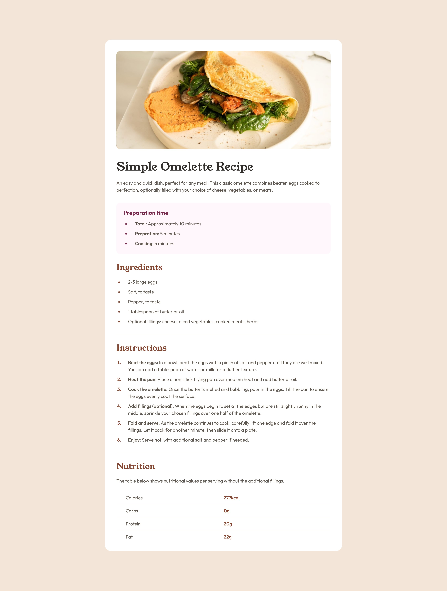

# Frontend Mentor - Recipe Page

## Table of contents

- [Overview](#overview)
  - [The challenge](#the-challenge)
  - [Screenshot](#screenshot)
  - [Live preview](#live-preview)
  - [Solution retrospective](#solution-retrospective)

## Overview

### The challenge

The challenge was to write semantic HTML and to ensure what HTML elements are most appropriate for each piece of content.

### Screenshot

### Live preview

- Live Site URL: [Live preview](https://marioncts.github.io/RecipePage/)

### Solution retrospective

For this challenge, I used the table element in HTML for the lower part of the recipe, which allowed me to revisit how to structure a clear and concise table.

I also wanted to deepen my understanding of CSS selectors and how to style very specific elements. I believe I achieved this goal, but looking back, I realize that some attributes could have been handled more efficiently—for example, by using the gap property on Flexbox elements instead.

I would be grateful for any kind of feedback!

